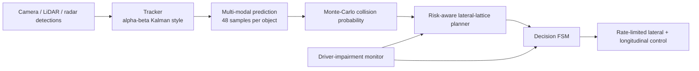

# Technical Write-up
## SIH26037 - Adaptive Path Planning and Collision Avoidance for Autonomous Vehicles on Unstructured Indian Roads

Organization: MathWorks | Theme: Smart Vehicles

---

## 1. What the problem asks
Plan safe, collision-free, real-time-replanned paths for an autonomous vehicle among auto-rickshaws, two-wheelers, pushcarts, pedestrians and animals, with no reliable lane markings, and validate on at least five Indian road scenarios using metrics such as replanning latency, path smoothness and scenario completion rate.

## 2. Pipeline

Replanning runs every 0.1 s.

## 3. Algorithms (as implemented in `av_core.py`)

**Tracking.** Each object has a position/velocity estimate updated by an alpha-beta filter (alpha 0.5, beta 0.25) from noisy measurements (0.25 m lateral, 0.5 m longitudinal). The position uncertainty sigma starts at 0.6 m and decays to 0.25 m as the track matures.

**Multi-modal prediction.** For every object, N = 48 trajectories are sampled over a 3 s horizon. Each sample picks a mode (continue 70 %, veer right 15 %, veer left 15 %; lateral drift 1.0 m/s for pedestrians, 0.5 m/s for other mobile objects, none for debris), then adds position noise (sigma from the tracker) and velocity noise.

**Collision probability.** For a candidate ego path p(t):

P_col = (1/N) * sum over samples of 1[ any t in horizon: sample is inside the ego safety box around p(t) ]

The safety box is (object half-width + 0.9 m) laterally and (object half-length + 2 m) ahead, both multiplied by a margin factor m = 1 + 0.5 * driver_risk.

**Risk level.** LOW / MEDIUM / HIGH from P_col with thresholds 0.06 and 0.20, both scaled by (1 - 0.5 * driver_risk) so an impaired driver makes the system react earlier. The reason string reports distance, P_col, time-to-collision and tracker sigma.

**Safe-path planning.** Candidate lateral offsets {-3 ... +3} m (limited by road width) are scored:

J(c) = 10 * P_col_total(c) + 0.5 * |c - x_ego| + 0.15 * |c - c_prev| + 0.1 * |c| (+ pull-over term during MRM)

where P_col_total = 1 - product over objects of (1 - P_col_i). The lowest-cost path is followed using a smoothstep lateral blend.

**Decision FSM.** CRUISE, EVADE (safe path exists), YIELD (slow down), EMERGENCY BRAKE (no safe path at HIGH risk), MRM PULL-OVER / MRM STOPPED.

**Control.** Lateral acceleration limited to 2.5 m/s^2; deceleration up to 7 m/s^2 (3 m/s^2 in MRM); acceleration 2 m/s^2.

## 4. Driver-impairment monitor (drink-and-drive safety)

Signals: PERCLOS, reaction time, lane-weave amplitude, breath alcohol (MQ-3 class sensor). Fused risk:

R_d = min(1, 0.30 * perclos/0.6 + 0.25 * react/1.2 + 0.20 * weave/0.65 + 0.25 * breath/0.5)

| R_d | State | System behaviour |
| :--- | :--- | :--- |
| < 0.30 | OK | Normal |
| 0.30 - 0.50 | WARN | Alert driver, speed cap 90 % |
| 0.50 - 0.75 | CONSERVATIVE | Speed cap 70 %, wider safety margins, earlier reaction |
| >= 0.75 | TAKEOVER | Autonomy in control |
| TAKEOVER for > 4 s | MRM | Hazards on, pull over to road edge, stop, notify emergency contact |

Breath alcohol above 0.3 mg/L locks the ignition (interlock). In the simulation the impairment level is a slider; no real sensor is read. Camera-based signs are impairment indicators, not proof of intoxication.

## 5. Scenarios

1. Village road (unmarked): debris, pushcart, crossing pedestrian, cows, two-wheelers
2. Urban intersection without signals: crossing cars, pedestrians, autos
3. Highway merge: slow truck, merging car, fast cars
4. Dense market: many pedestrians, carts, autos, erratic two-wheelers
5. Sudden cattle crossing: cows crossing and standing on the road

## 6. Results (25 s per run, seeds 11 to 15, produced by `av_core.benchmark()`)

| Scenario | Planner | Collisions | Min gap (m) | Distance (m) | RMS lat. accel (m/s^2) | Completed* |
| :--- | :--- | :--- | :--- | :--- | :--- | :--- |
| Village road | Ours | 0 | 0.81 | 67.2 | 1.68 | No |
| Village road | Brake-only | 0 | 2.19 | 26.9 | 0.00 | No |
| Urban intersection | Ours | 0 | 0.90 | 157.6 | 1.31 | Yes |
| Urban intersection | Brake-only | 0 | 3.64 | 116.8 | 0.00 | Yes |
| Highway merge | Ours | 0 | 1.29 | 127.2 | 1.41 | No |
| Highway merge | Brake-only | 0 | 6.08 | 123.8 | 0.00 | No |
| Dense market | Ours | 0 | 1.59 | 53.7 | 1.40 | No |
| Dense market | Brake-only | 0 | 3.33 | 47.1 | 0.00 | No |
| Cattle crossing | Ours | 0 | 1.65 | 112.1 | 1.29 | No |
| Cattle crossing | Brake-only | 0 | 3.00 | 33.5 | 0.00 | No |

\*Completed = no collision and at least 60 % of the cruise-speed distance. Replanning latency is about 0.3 to 1.7 ms per cycle in pure Python on the machine used (hardware dependent).

**Reading these results honestly**
- Both planners had zero collisions in all five scenarios.
- Our planner travelled further than the brake-only baseline in all five (for example 112 m vs 34 m in the cattle crossing) because it steers around hazards instead of stopping.
- Our planner passes closer to obstacles (min gap 0.8 to 1.7 m vs 2.2 to 6.1 m) and is therefore less conservative. Margins need tuning for a real vehicle.
- Under the strict completion criterion, only 1 of 5 scenarios completes for either planner. These are results of a simple 2-D simulation, not evidence of real-world safety.

## 7. Limitations and next steps

- Detection is simulated. Next: YOLO fine-tuned on the India Driving Dataset (IDD), LiDAR clustering, sensor fusion.
- Tracker is alpha-beta, not a full IMM. Prediction modes are simple. Next: IMM-Kalman and an LSTM/Transformer trajectory predictor, evaluated with ADE/FDE.
- Planner is a one-dimensional lateral lattice. Next: Frenet lattice with longitudinal profiles, Hybrid A* for global planning, MPC with a bicycle model.
- Map to MathWorks tools: RoadRunner scenes (village road, urban intersection), Automated Driving Toolbox (sensor models, fusion), Navigation Toolbox and Stateflow (planner and FSM), Simulink bicycle model (vehicle dynamics), Deep Learning Toolbox (detection, prediction).
- Deliverables still to produce for the competition: MATLAB/Simulink model, RoadRunner scenes, demo video, short technical report.
